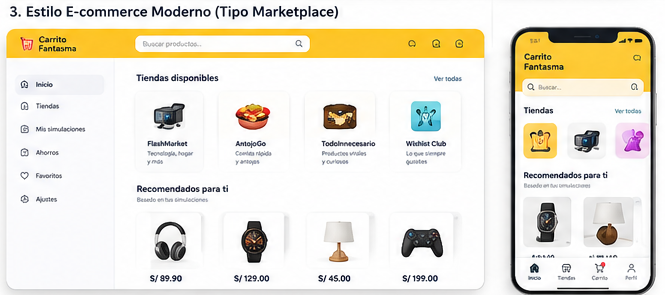
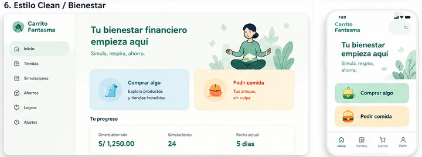

# Revisión de mockups

**Estado:** propuesta de dirección visual para el MVP, pendiente de aprobación
**Mockups revisados:** `mockup_marketplace.png` y `mockup_bienestar.png`
**Alcance:** análisis de producto y UX; no autoriza implementar todavía

## Resumen ejecutivo

Los dos mockups resuelven partes distintas del problema:

- **Marketplace** comunica inmediatamente “aquí se navega y se llena un carrito”. Tiene más energía, familiaridad y potencial para contenido corto, pero se acerca demasiado a una tienda real y no explica con suficiente rapidez que la compra es ficticia.
- **Bienestar** transmite calma, intención positiva y mayor confianza. Explica mejor la secuencia “simula, respira, ahorra”, pero puede parecer una app genérica de finanzas o hábitos y no muestra con fuerza el ritual de compra que se quiere validar.

La recomendación no es mezclar dos interfaces visualmente incompatibles. Conviene adoptar **una sola identidad basada en la calma, espacio y diferenciación de Bienestar**, e incorporar dentro de ella **los patrones funcionales de catálogo, producto y carrito de Marketplace**. La Home debe explicar explícitamente la compra falsa; el catálogo debe hacer tangible el ritual.

## Referencias

### Mockup Marketplace

### Mockup Bienestar

## Comparación por criterio

| Criterio | Marketplace | Bienestar | Lectura de producto |
|---|---|---|---|
| 1. Claridad del concepto | Media | Media-alta | Marketplace explica la acción, pero no el propósito. Bienestar explica el propósito, pero no demuestra el ritual. |
| 2. Rapidez para comunicar “compra falsa para evitar gasto real” | Baja-media | Media-alta | “Simula, respira, ahorra” ayuda. Ninguno dice de forma suficientemente explícita “no compras ni pagas de verdad”. |
| 3. Confianza | Media-baja | Alta | Marketplace puede confundirse con comercio real. Bienestar se siente más seguro, aunque debe evitar parecer asesoría financiera. |
| 4. Tono emocional | Alto en diversión | Alto en calma | Marketplace es más juguetón. Bienestar es más amable, pero “sin culpa” introduce la idea de culpa que se quiere evitar. |
| 5. Diferenciación de marcas reales | Media-baja | Alta | El header amarillo, buscador, recomendados y navegación de Marketplace recuerdan patrones muy reconocibles. Bienestar tiene más espacio para una identidad propia. |
| 6. Usabilidad móvil | Media-alta | Alta | Ambos son legibles. Marketplace tiene mayor densidad y navegación innecesaria; Bienestar presenta dos decisiones claras. |
| 7. Potencial para TikTok/Reels/Shorts | Alto | Medio | Agregar productos y revelar el ahorro produce un video más dinámico. La Home de Bienestar funciona mejor como primer y último encuadre. |
| 8. Facilidad en React/Tailwind | Media-alta | Alta | Ambos son viables. Marketplace exige más estados y componentes; Bienestar es simple salvo por estadísticas, logros y rachas. |
| 9. Riesgo de sobrepulido | Alto | Alto | Marketplace sugiere buscador, favoritos, perfil y personalización. Bienestar sugiere dashboard, logros y rachas. Ninguno debe implementarse completo. |
| 10. Riesgo de parecer solo meme | Alto | Bajo-medio | Marketplace puede quedar como tienda de broma. Bienestar aporta intención seria, pero necesita el ritual para no volverse una landing genérica. |

## Mockup Marketplace

### Resumen

Presenta Carrito Fantasma como una plataforma de compras consolidada: header amarillo, búsqueda, tiendas, recomendaciones, precios, navegación lateral en desktop y barra inferior en móvil. La marca y los nombres ficticios ayudan, pero la interfaz prioriza descubrir productos sobre entender por qué existe la experiencia.

### Pros

- Comunica instantáneamente patrones conocidos de e-commerce.
- Hace tangible el ritual de explorar, elegir y agregar al carrito.
- La jerarquía de tiendas, catálogo y precios es fácil de escanear.
- Tiene energía visual y momentos fáciles de grabar para un video corto.
- Los productos y tiendas ficticias permiten variedad sin integración real.
- Se traduce bien a componentes independientes en React.
- El grid móvil puede dar una sensación satisfactoria con poco contenido.

### Contras

- No explica visiblemente que no habrá compra, cobro ni envío reales.
- El header amarillo, buscador y navegación pueden recordar demasiado a marketplaces existentes.
- “Recomendados para ti” implica personalización que no existe y que el MVP no necesita.
- Favoritos, perfil, ajustes y múltiples destinos de navegación dispersan el flujo.
- El carrito como icono convencional, sin señal de simulación, aumenta la ambigüedad.
- Las fotos y precios pueden aumentar el deseo en lugar de ayudar a dejarlo pasar.
- La versión desktop introduce una sidebar que no aporta a la validación mobile-first.

### Riesgos

- Que una persona crea que está entrando a una tienda real o a una experiencia afiliada.
- Que la confianza dependa únicamente del nombre “Fantasma”, que puede interpretarse como marca y no como simulación.
- Que el equipo invierta tiempo en búsqueda, recomendaciones, favoritos y perfil antes del recorrido central.
- Que el producto se comparta como una tienda absurda o meme, sin intención de reutilización.
- Que la semejanza estructural y cromática con marcas reales reduzca diferenciación.
- Que un catálogo demasiado aspiracional o fotorealista refuerce el impulso.

### Elementos que conviene tomar

- Tarjetas de tienda ficticia con nombre, propósito y estilo propio.
- Grid compacto de productos con imagen, nombre y precio.
- Acceso contextual y visible al carrito.
- Categorías fáciles de recorrer.
- Secuencia visual dinámica para mostrar en video: producto → carrito → checkout → resultado.
- Componentización natural de tienda, producto, precio y carrito.

### Elementos que conviene descartar o posponer

- Header amarillo dominante.
- Copia cercana de navegación o composición de marketplaces conocidos.
- Sidebar desktop en la primera versión.
- Perfil, favoritos, ajustes y notificaciones.
- “Recomendados para ti” y cualquier personalización implícita.
- Buscador antes de comprobar que el tamaño del catálogo lo necesita.
- Badges, urgencia, stock, descuentos agresivos o reseñas falsas.
- Fotografías de productos reales reconocibles si pueden estimular más el deseo.

## Mockup Bienestar

### Resumen

Presenta Carrito Fantasma como una herramienta de bienestar financiero. Usa tonos verdes, abundante espacio, una ilustración de calma, dos acciones principales y un resumen de progreso. En móvil la elección “Comprar algo” o “Pedir comida” es inmediata y fácil de tocar.

### Pros

- “Simula, respira, ahorra” comunica mejor el propósito conductual.
- Se siente seguro, sereno y claramente distinto de una tienda real.
- La Home móvil tiene pocas decisiones y buena jerarquía.
- Los modos e-commerce y delivery están separados de forma comprensible.
- La paleta suave y los espacios reducen presión y urgencia.
- Es fácil crear una versión responsive simple con React y Tailwind.
- El ahorro puede convertirse en una recompensa positiva al final del flujo.
- Reduce el riesgo de que la aplicación parezca una estafa o checkout encubierto.

### Contras

- “Tu bienestar financiero empieza aquí” suena amplio y puede prometer más de lo que el MVP valida.
- La ilustración de meditación puede convertir el producto en una app genérica de mindfulness.
- El ritual de compra no se entiende hasta pulsar una de las opciones.
- “Tus antojos, sin culpa” pretende ser amable, pero introduce culpa como marco emocional.
- Dinero ahorrado, simulaciones y racha aparecen con datos de ejemplo que un usuario nuevo no tendría.
- Logros, perfil y racha sugieren gamificación y cuentas fuera del alcance.
- Una Home demasiado estática tiene menor impacto en demostraciones de video.

### Riesgos

- Que se confunda con un dashboard financiero, app de presupuesto o producto terapéutico.
- Que la promesa de “bienestar financiero” genere expectativas de asesoría o seguimiento que no se cumplen.
- Que rachas y logros conviertan una herramienta ocasional en una obligación culpabilizante.
- Que mostrar cifras ficticias de progreso reduzca confianza.
- Que el producto pierda su elemento más diferenciador: completar una compra fantasma.
- Que el lenguaje visual quede tan serio que limite humor, recordación y viralidad.

### Elementos que conviene tomar

- Paleta calmada y claramente propia, con contraste accesible.
- Espacio visual, bordes suaves y baja presión.
- Selector de dos modos como decisión principal de la Home.
- Mensaje breve que conecta simulación, pausa y ahorro.
- Ahorro como recompensa, mostrado con datos reales del historial local.
- Tono de acompañamiento y agencia.
- Simplicidad del layout móvil.

### Elementos que conviene descartar o posponer

- “Tu bienestar financiero empieza aquí” como promesa principal.
- “Sin culpa” y cualquier copy que active vergüenza o juicio.
- Ilustración literal de meditación como identidad central.
- Rachas, logros, perfil y estadísticas inventadas.
- Dashboard de progreso antes de que exista historial local.
- Desktop sidebar como prioridad de implementación.
- Cualquier apariencia de herramienta clínica o de asesoría financiera.

## Recomendación

### Dirección propuesta

Usar **Bienestar como sistema de marca y tono**, y **Marketplace como gramática de interacción**.

Esto significa:

- La Home y el resultado usan calma, espacio, lenguaje positivo y colores propios.
- La Home dice explícitamente qué hace el producto, por ejemplo: “Llena un carrito ficticio. No pagas nada. Deja pasar el impulso.”
- Al entrar al modo elegido, la experiencia adopta tarjetas de tienda, catálogo, detalle y carrito familiares.
- Una señal persistente y ligera, como “Simulación · no se realizará ninguna compra”, acompaña catálogo, carrito y checkout.
- El resultado vuelve al tono calmado y muestra el monto que no se gastó.
- Todo se siente parte de una sola marca; no se cambia de una app verde a una copia amarilla de marketplace.

### Por qué esta combinación

La hipótesis no se valida con una landing de bienestar ni con una tienda de broma aislada. Se valida cuando una persona entiende la intención, confía lo suficiente para empezar, completa un ritual reconocible y llega a una recompensa que le da cierre. Bienestar resuelve entrada y confianza; Marketplace resuelve acción y demostrabilidad.

## Decisión propuesta para el MVP

1. Adoptar una identidad principal verde/menta o teal, con un acento cálido propio para acciones y modo comida.
2. Diseñar primero el viewport móvil de aproximadamente 360 px; desktop será una adaptación, no una segunda aplicación con sidebar.
3. Usar Home de una sola tarea: explicación explícita, rating opcional y selector de dos modos.
4. Usar catálogo familiar, pero sin buscador, favoritos, perfil, recomendaciones personalizadas ni notificaciones en P0.
5. Mantener una indicación visible de simulación durante el recorrido.
6. Crear productos estilizados y ficticios; evitar fotos o marcas que activen deseo real de forma innecesaria.
7. Usar un checkout resumido y claramente falso, sin imitar campos o sellos de pago.
8. No mostrar logros, rachas o ahorro acumulado inventado. El historial empieza vacío y crece solo con sesiones locales reales.
9. Conservar humor ligero en nombres y microcopy, dentro de una experiencia útil y respetuosa.
10. Probar comprensión antes de pulir animaciones, ilustraciones o versión desktop.

Esta decisión es una propuesta de diseño, no una aprobación para implementar.

## Secuencia recomendada para videos cortos

El producto debería producir de manera natural un clip de 12–20 segundos:

1. **Hook:** “¿Te dieron ganas de comprar esto?”
2. **Concepto:** “Haz la compra fantasma. No pagas nada.”
3. **Acción:** agregar dos o tres productos al carrito.
4. **Ritual:** completar checkout falso y ver tracking simbólico.
5. **Payoff:** “No gastaste S/ X”.
6. **Cierre:** “¿Bajó el impulso?”

Marketplace aporta la parte visualmente activa; Bienestar aporta claridad y un cierre creíble. No añadir pantallas solo para que el video sea más llamativo.

## Lista de componentes visuales a implementar

### Fundamentos

- `AppShell`: contenedor mobile-first y adaptación simple a pantallas amplias.
- `BrandLockup`: nombre e identidad original de Carrito Fantasma.
- `SimulationBadge`: señal persistente “Simulación · sin cobro”.
- `PrimaryButton` y `SecondaryButton`.
- `Card`, `Price`, `CategoryChip` y estados de foco/carga/error.
- Tokens de color, tipografía, espaciado, radios, sombras y movimiento reducido.

### Home

- `ConceptIntro`: explicación breve y explícita.
- `ImpulseModeCard`: “Comprar algo” y “Pedir comida”.
- `UrgeRating`: escala opcional 1–5 con extremos escritos.
- `HistoryLink`: acceso secundario cuando exista historial.

### Exploración

- `StoreCard` o `StoreStrip`: solo si se mantienen varias tiendas en el primer piloto.
- `CategoryChips`: filtro simple y horizontal.
- `ProductCard`: imagen ficticia, nombre, precio y acción clara.
- `ProductGrid`: uno o dos elementos por fila según ancho real.
- `ProductDetail`: página o sheet accesible con regreso predecible.
- `CartShortcut`: acceso contextual con cantidad, sin barra de navegación sobredimensionada.

### Carrito y ritual

- `CartLineItem`: producto, cantidad, subtotal y eliminar.
- `CartSummary`: total y aviso de simulación.
- `FakeCheckoutSummary`: confirmación sin formularios personales.
- `SymbolicTrackingStepper`: secuencia breve, saltabilidad y movimiento reducido.
- `SavingsReveal`: monto no gastado y celebración sobria.
- `ShareAction`: acción opcional y controlada por el usuario.

### Historial

- `HistoryEmptyState`: explicación sin cifras inventadas.
- `SavingsSummary`: total derivado de sesiones locales reales.
- `HistoryItem`: fecha, modo, tienda, cantidad y total.
- `ClearHistoryDialog`: confirmación accesible.

## Componentes que no deben implementarse en esta etapa

- Sidebar desktop completa.
- Perfil o avatar.
- Favoritos.
- Centro de notificaciones.
- Recomendaciones personalizadas.
- Logros, rachas o ranking.
- Dashboard financiero avanzado.
- Buscador global con sugerencias.
- Mapas o tracking logístico realista.
- Carruseles complejos y animaciones de alto costo.

## Validaciones antes de implementar el look definitivo

- Mostrar la Home híbrida en baja fidelidad a cinco personas sin explicar el producto.
- Preguntar qué creen que ocurrirá al tocar “Comprar algo”.
- Confirmar que nadie espera pagar, recibir un producto o entregar datos.
- Comparar una versión con copy explícito frente a “Simula, respira, ahorra”.
- Comprobar si las tarjetas de productos aumentan o reducen el impulso.
- Probar si el humor de las tiendas ayuda a recordar la herramienta sin convertirla en meme.
- Validar contraste, tamaño táctil y jerarquía a 320–375 px antes de diseñar desktop.
